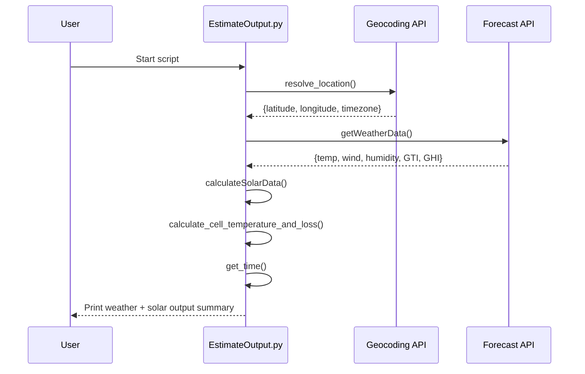

# Balcony PV Output Estimator (`EstimateOutput.py`)

## 1. Purpose

This script provides a **real‑time estimate of the electrical power output** of a small photovoltaic system (e.g., balcony solar). It uses **live weather and irradiance data** from Open‑Meteo and applies a **physics‑based PV performance model** to compute:

- Global tilted irradiance (GTI) on your panel surface  
- Cell temperature and temperature‑related power losses  
- DC output per panel and total array output  
- Final AC output after inverter efficiency  

The result is a **transparent, engineering‑oriented snapshot** of how much power your PV system is producing right now, based solely on your location and panel parameters.

A typical output would look like this
```
Current time:
2026-07-12T08:53:51+02:00 (Europe/Berlin)

Current weather and estimated solar data:
Weitenung, Germany: 23.2°C, wind 4.5 m/s, humidity 50%,feels like 21.6°C,  Clear sky 
panel tilt: 26.5°, panel azimuth: 35°
horizontal solar irradiance: 384 W/m^2 
tilted solar irradiance:196 W/m^2 
effective irradiance per panel: 40 W/m^2 
cell temperature: 28.2°C 
cell temp loss factor: 0.988 
panel DC output: 79 W 
array DC output: 155 W 
AC output: 147 W
```

>[!NOTE]
>This model is designed for monofacial panels only, meaning it does not consider albedo effects or rear-side irradiance typical of bifacial panels.

---

## 2. Installation & execution

### 2.1. Requirements

- Python **3.11+** (for `zoneinfo`)
- Internet access (Open‑Meteo API calls)
- No external libraries — only Python’s standard library is used

### 2.2. Standard library modules used

| Module | Purpose |
|--------|---------|
| `json` | Parse API responses |
| `datetime` | Current time handling |
| `urllib.request` | HTTP requests |
| `urllib.parse` | URL encoding |
| `urllib.error` | Network error handling |
| `zoneinfo` | Timezone‑aware timestamps |

### 2.3. Setup

Save the script as `EstimateOutput.py`.

### 2.4. Configuration

Before running, adjust the constants at the top of the script (see section 3).

### 2.5. Run

```
python EstimateOutput.py
```

The script prints:

- Current local time  
- Weather conditions  
- Irradiance values  
- Estimated DC and AC output  

---

## 3. Configuration & customization options

All configuration happens via constants at the top of the script.

### 3.1. Location

| Constant | Example | Meaning | When to change |
|----------|---------|---------|----------------|
| `CITY_NAME` | `"Weitenung"` | City name for geocoding | Set to your city |
| `COUNTRY_CODE` | `"DE"` | ISO country code | Set to your country |

### 3.2. Panel geometry & rating

| Constant | Example | Meaning |
|----------|---------|---------|
| `PANEL_LENGTH_M` | `1.72` | Panel length (m) |
| `PANEL_WIDTH_M` | `1.13` | Panel width (m) |
| `PANEL_RATED_POWER_W` | `400` | Rated power at STC |
| `PANEL_COUNT` | `2` | Number of panels |

Derived:

| Derived constant | Formula | Meaning |
|------------------|---------|---------|
| `PANEL_AREA_M2` | length × width | Panel area |
| `PANEL_STC_EFFICIENCY` | rated power ÷ (1000 × area) | STC efficiency |

### 3.3. System AC efficiency

| Constant | Example | Meaning |
|----------|---------|---------|
| `SYSTEM_AC_EFFICIENCY` | `0.95` | Inverter + wiring efficiency |

### 3.4. Orientation

| Constant | Example | Meaning |
|----------|---------|---------|
| `PANEL_TILT_DEG` | `26.5` | Tilt angle (0° horizontal, 90° vertical) |
| `PANEL_AZIMUTH_DEG` | `35` | Orientation relative to South (clockwise toward West) Check https://azimut.polka-umwelt.de/ to determine your panel azimuth via map measurement.|

### 3.5. Temperature model (Faiman)

| Constant | Example | Meaning |
|----------|---------|---------|
| `U0` | `21.4` | Base heat transfer coefficient |
| `U1` | `4.02` | Wind cooling coefficient |
| `TEMP_COEFF` | `-0.0038` | Power loss per °C above 25°C |

>[!NOTE]
> These defaults are for Ground-mounted panels.
>U0/U1 are intentionally chosen lower than the Faiman standard values to underestimate wind cooling and therefore produce a conservative (lower) power estimate.

---

Faiman model default U0 and U1 values reported in literature
| Mounting Scenario | Recommended Faiman Values (U0 / U1) | Notes |
| --- | --- | --- |
| **Ground‑mounted (Free‑standing / Field)** | **≈25 / ≈6.84** | Very good ventilation; strong wind‑driven cooling expected. |
| **Vertically mounted (Solar Fence / Facade)** | **≈25–27 / ≈5–7** | Moderate ventilation; reduced wind cooling compared to open‑rack. |
| **Roof‑mounted (Parallel to the roof)** | **≈29–32 / ≈5–7** | Poor ventilation; roof heating increases cell temperature. |

## 4. How it works (Program flow)

### 4.1. Logical flow

1. **Resolve location**  
   Geocoding API → latitude, longitude, timezone

2. **Fetch weather & irradiance**  
   Forecast API → temperature, wind, humidity, GTI, GHI

3. **Compute PV performance**  
   - Cell temperature (Faiman model)  
   - Temperature loss factor  
   - DC output per panel  
   - Total DC and AC output  

4. **Print summary**  
   Human‑readable output

### 4.2. Sequence diagram



---

## 5. Algorithms & models used

### 5.1. PV efficiency model

Panel DC output:

$$
P_{\mathrm{panel}} = \mathrm{GTI} \cdot A \cdot \eta_{\mathrm{STC}}
$$

Total DC:

$$
P_{\mathrm{DC}} = P_{\mathrm{panel}} \cdot N \cdot f_{\mathrm{temp}}
$$

AC output:

$$
P_{\mathrm{AC}} = P_{\mathrm{DC}} \cdot \eta_{\mathrm{AC}}
$$

### 5.2. Faiman temperature model

Cell temperature:

$$
T_{\mathrm{cell}} = T_{\mathrm{amb}} + \frac{\mathrm{GTI}}{U_0 + U_1 v_{\mathrm{wind}}}
$$

Temperature loss factor:

$$
f_{\mathrm{temp}} =
\begin{cases}
1 & T_{\mathrm{cell}} \le 25^\circ\mathrm{C} \\
1 + \mathrm{TEMP\_COEFF} \cdot (T_{\mathrm{cell}} - 25) & T_{\mathrm{cell}} > 25^\circ\mathrm{C}
\end{cases}
$$

### 5.3. Why these models?

- Linear irradiance scaling is standard for crystalline silicon modules  
- Faiman model is widely used for real‑time PV temperature estimation  
- AC efficiency factor simplifies inverter modeling while remaining realistic  

---

## 6. Open‑Meteo weather data analysis

### 6.1. Geocoding API fields

| Field | Meaning |
|-------|---------|
| `latitude` | Geographic latitude |
| `longitude` | Geographic longitude |
| `timezone` | Local timezone |
| `name` | City name |
| `country` | Country |

### 6.2. Forecast API fields

| Script key | API key | Meaning |
|------------|----------|---------|
| `temp_c` | `temperature_2m` | Ambient temperature |
| `apparent_temperature` | same | Feels‑like temperature |
| `humidity` | `relative_humidity_2m` | Relative humidity |
| `raw_code` | `weather_code` | Weather condition code |
| `description` | derived | Human‑readable weather text |
| `wind_speed` | `wind_speed_10m` | Wind speed (km/h) |
| `wind_speed_ms` | derived | Wind speed (m/s) |
| `tilted_irradiance` | `global_tilted_irradiance` | GTI (W/m²) |
| `horizontal_irradiance` | `shortwave_radiation` | GHI (W/m²) |

---

## 7. Exkurs: Radiation types & manual GTI calculation

### 7.1. GHI (horizontal irradiance)

GHI is the **total solar irradiance on a horizontal surface**, consisting of:

- Direct beam  
- Diffuse sky radiation  

Open‑Meteo’s `shortwave_radiation` corresponds to GHI.

### 7.2. GTI (global tilted irradiance)

GTI is the irradiance **on the tilted panel surface**, depending on:

- Panel tilt  
- Panel azimuth  
- Sun position  
- Direct + diffuse + reflected components  

Open‑Meteo computes GTI automatically using your tilt and azimuth.

### 7.3. Manual GTI calculation (if GTI is not available)

If you only have GHI, you can compute GTI manually:

#### Step 1 — Decompose GHI  
Use empirical models (Erbs, Reindl) to estimate:

- DNI (direct normal irradiance)  
- DHI (diffuse horizontal irradiance)

#### Step 2 — Compute sun position  
Solar zenith and azimuth from time + location.

#### Step 3 — Direct irradiance on tilted surface

Angle of incidence:

$$
\cos(\theta_{i}) = \sin(\theta_{z})\cos(\gamma_{s} - \gamma_{p})\sin(\beta) + \cos(\theta_{z})\cos(\beta)
$$

Direct component:

$$
I_{\mathrm{direct,tilt}} = \mathrm{DNI} \cdot \max(\cos(\theta_i), 0)
$$

#### Step 4 — Diffuse component (isotropic model)

$$
I_{\mathrm{diffuse,tilt}} = \mathrm{DHI} \cdot \frac{1 + \cos(\beta)}{2}
$$

#### Step 5 — Ground reflection (optional)

$$
I_{\mathrm{reflected}} = \mathrm{GHI} \cdot \rho \cdot \frac{1 - \cos(\beta)}{2}
$$

#### Step 6 — Combine

$$
\mathrm{GTI} = I_{\mathrm{direct,tilt}} + I_{\mathrm{diffuse,tilt}} + I_{\mathrm{reflected}}
$$

This GTI can then be used exactly as in the script to compute DC and AC output.
